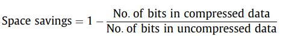
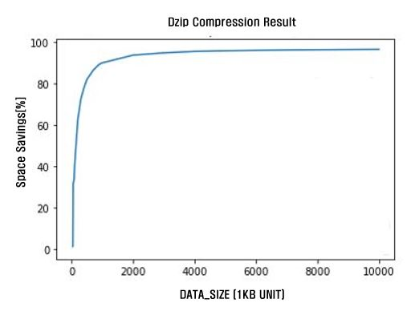

# AI_compression_model


## Description

- biGRU 기반 압축 모델 Dzip

  - 산술 부호화와 결합된 RNN 기반 모델링을 사용하는 시퀀셜 데이터 무손실 압축기

  - 결합된 모델을 사용하여 데이터를 압축하는 동안 적응적으로 학습됨.

    

## DATA

- CAN_DATA : CAR HACKING: ATTACK & DEFENSE CHALLENGE 2020
  - https://ieee-dataport.org/open-access/car-hacking-attack-defense-challenge-2020-dataset
    - CITATION : Hyunjae Kang, Byung Il Kwak, Young Hun Lee, Haneol Lee, Hwejae Lee, Huy Kang Kim, February 3, 2021, "Car Hacking: Attack & Defense Challenge 2020 Dataset", IEEE Dataport, doi: [https://dx.doi.org/10.21227/qvr7-n418](https://www.google.com/url?q=https%3A%2F%2Fdx.doi.org%2F10.21227%2Fqvr7-n418&sa=D&sntz=1&usg=AOvVaw33jtPkJFFezo3LcnKQmvju)
  
  - 해당 데이터 셋에서 정상 주행 및 정차 데이터만 압축에 사용하였음.


## Dzip Compression RESULT

- 압축 성능 지표는 Space savings 를 사용함.

  




- CAN 데이터 크기를 증가시키며 Space Savings 결과를 확인한 그래프 


## Environment

- Ubuntu 18.04
- CUDA 11.1
- cudnn 8
- docker
- Python 3.6.10


## Download and install dependencies

```
git clone https://github.com/AutomotiveNegotiation2/2022-C2-AI-ComPression.git
cd AI_based_compression
./setup.sh
```


## HOW TO USE

- 데이터 압축

- 압축된 데이터 해제

- 압축 전과 압축 해제 후 비교(무결성 확인)


### Data Compression

- 입력 : 압축 데이터와 압축된 데이터명, 압축 모델 가중치
- 출력 : 압축된 데이터, 압축 모델 가중치

```
./compress.sh [can_data.csv] [compressd_file_name] [model_path]
```


### Data Decompression

- 입력 : 압축된 데이터와 압축 해제된 데이터명, 압축 모델 가중치
- 출력 : 압축 해제된 데이터 명

```
./decompress.sh [compressed_file_name] [decompress_file_name] [model_path]
```


### Check Lossless

- 압축 전 데이터와 압축 해제 데이터 비교

```
./comprate.sh [can_data.csv] [decompress_file_name]
```


### Data split

- CAN 데이터가 갖는 주기 특성에 따라 CAN 데이터를 0.1 ms, 0.5ms, 1ms, 2ms 로 분할하는 프로그램

```
python3 data_gen.py --file_name [CAN_data.csv]
```


**CITE**

- DZip: improved general-purpose loss less compression based on novel neural network modeling
  - https://github.com/mohit1997/Dzip-torch
