# 차량 내부 네트워크 데이터 압축 프로그램 모듈

- 차량 내부 네트워크 내 시계열 데이터 특성을 활용한 AI 기반 압축 SW

- Contributors : KETI(한국전자기술연구원)
- TASK : 차량 센서 데이터 압축 기술 구현

## Directory Layout

- Compression Code
  - AI_based_compression
  - Rule_based_compression

### Compression Code Description

- **AI_based_compression** : biGRU 기반 AI 압축 모델(Dzip)
  - 압축 성능이 좋으나 실시간 압축 불가 -> 하이브리드 압축 모델로 압축 방식 개선
  - version 1.0.0
- **Rule_based_compression** : 복셀라이제이션 기반 압축 모델
  - PCD 데이터 압축 방식 고도화 예정
  - version 1.0.0

# RESULT

### 압축 성능 지표

- 데이터 압축 성능 지표

 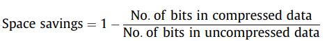

### CAN Compression

- **AI 기반 압축 모델(Dzip) 및 룰셋 기반 압축 성능 비교**
  - 1차년도의 룰셋 기반 압축 알고리즘(LZMA, bz2, zlib)
  - 2차년도 AI 기반 압축 모델(Dzip)

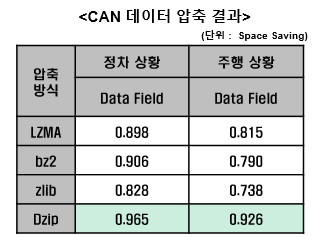

- 정차 상황에서 룰셋 기반 압축의 성능(Space savings)은 주행 상황보다 높으며, AI 기반 압축 모델은 정차 및 주행 상황 모두에서 압축 성능이 뛰어남. 
- CAR HACKING: ATTACK & DEFENSE CHALLENGE 2020 데이터를 활용하여 압축함.

  - 주행 상황 : 12.9 MB
  - 정차 상황 : 12.3 MB

### Lidar Compression

- 2차년도 룰셋 기반 압축 모델(Voxelization)
  - Rule 기반 압축 모델 활용 차량 라이다 데이터 성능 평가

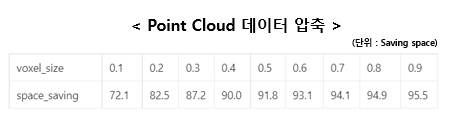

## Data open

- 상용차
- GPS : 1
- CAMERA : 4
- CANFD : Chassis
- DEM(Driving Environment Monitoring) 메시지, CAM(이미지) 데이터, CANFD, GPS 데이터로 구성되어 있음
- 1초마다 생성된 데이터를 파싱하여 년월일_시분초_미리초 디렉토리에 저장함
- 디렉토리 내용 설명

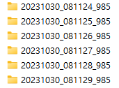

- 디렉토리 내부 구조 (CAM, CAN, DEM, GPS 구성)

- 파싱된 데이터 내용
- CAM : 차량 상단에 설치된 전후좌우 카메라 데이터(1 Hz)
- CAN : 차량에서 생성된 CANFD 데이터 (1초 동안 수집)
- DEM : 차량에서 생성된 DEM 데이터 (10Hz)
- GPS : 차량에 설치된 GPS에서 생성된 데이터(10Hz)
- 데이터 샘플 예시

- DEM
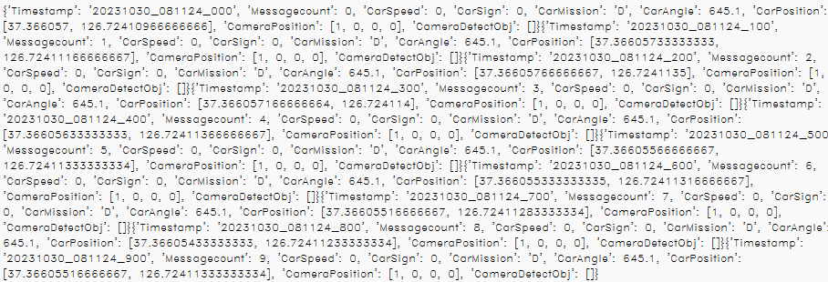

- GPS

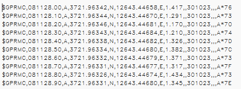

- CANFD
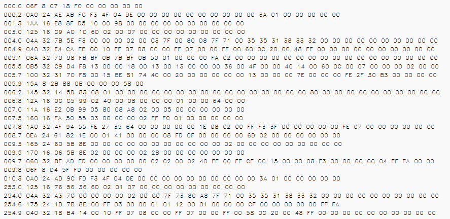

- CARMERA
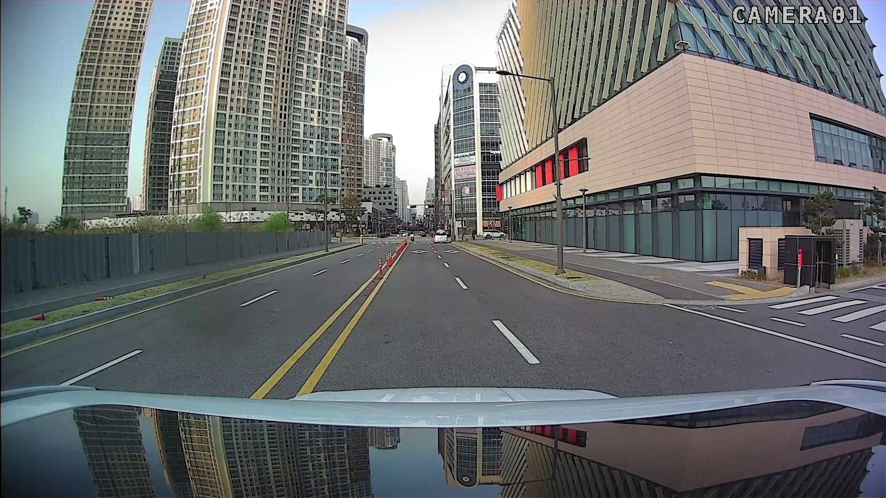

링크 : https://drive.google.com/drive/folders/1eHA4Y8LepUrlAJCojASYY52QQPSNrpHZ?usp=drive_link

## CANFD DATASET

### 1. DATASET RELEASE

- 해당 데이터는 상용차(카니발)에서 수집한 CANFD 정상 데이터셋으로 구성됨.
- 샤시 CANFD 네트워크에서 수집한 차량 제어 데이터셋임

### 2. DATASET

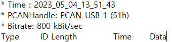

**2-1. data attributes** 

- Type : STD[FDBRS]는 FD 프레임 형식의 사용,  BRS(bit-rate switch) 비트의 샘플 포인트에서 비트율 전환이 수행을 의미함
- ID : 16진수 형태의 CANFD 메시지 식별자
- Length : 데이터의 바이트 수
- Time : 저장 타임스탬프(로컬 시간)
- Data : Data value (byte)

**2-2** **dataset Description**

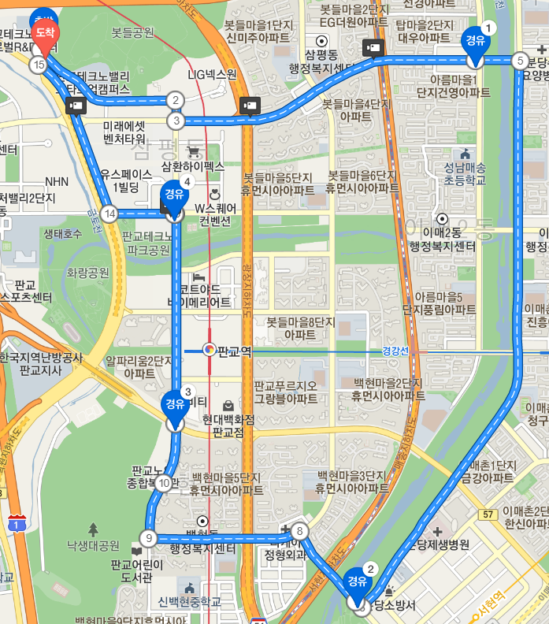

- 2023_05_04_11_08_37_판교주행

  - 약 30분 주행한 데이터셋(312M)

  - 고속 및 저속 주행이 포함되어 있으며 급가속 상황 있음(정차 포함)

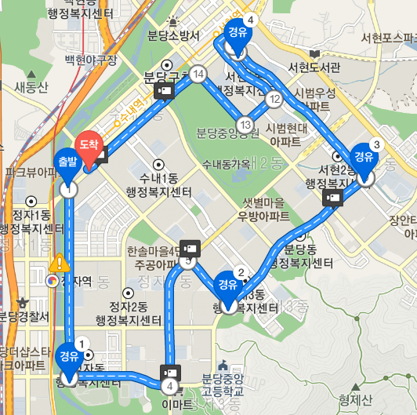

- 2023_05_04_11_53_50_정자주행
  - 약 30분간 주행한 데이터셋(272MB)
  - 고속 및 저속 주행이 포함되어 있으며 급가속 상황 있음(정차 포함)

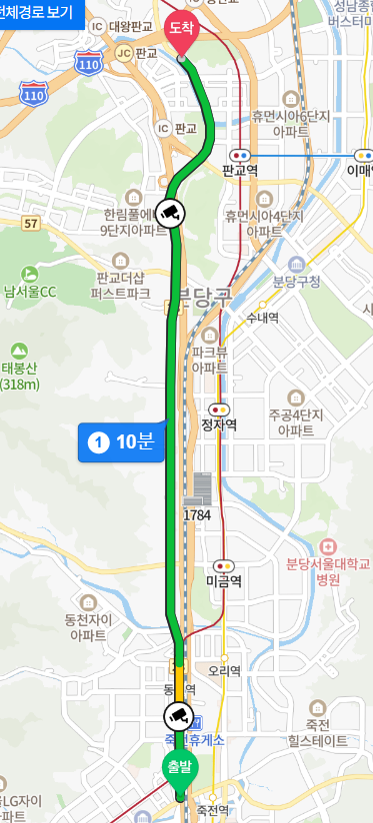

- 2023_05_04_13_51_43죽전신호등_고속
  - 약 15분간 주행한 데이터셋(106MB)
  - 고속과 저속이 골고루 있으며 정차 포함

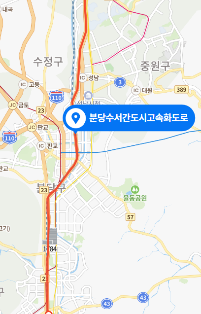

- 2023_05_04_14_27_02_고속화도로
  - 약 15분간 주행한 데이터셋(130MB)
  - 저속과 고속이 고루 분포하며 정차하지 않음

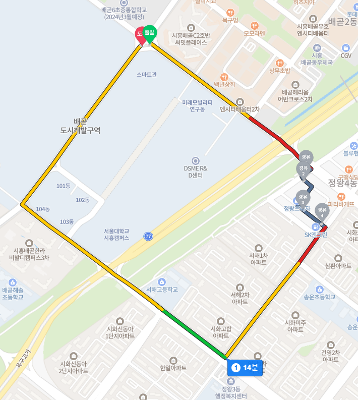

- 2023_10_30_17_13_08_에스유엠인근
  - 약 30분 간 주행한 데이터셋(302MB)
  - 도심에서 주행 및 정차 상황(주유소에서 정차 상황 포함)

https://drive.google.com/drive/folders/1q6BlaVfhL8DpyhRHqT7par3zRNFZTzsJ?usp=drive_link

------------------------------------

### version
- version 1.0.0

- CAN Compression and Lidar Compression
   - CAN Compression : Dzip, Lidar Compression : Voxelization

   

